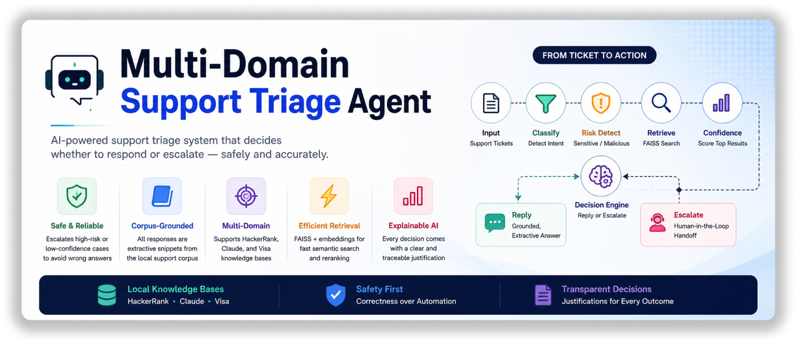

# Multi-Domain Support Triage Agent

## Overview

This project implements a **terminal-based support triage system** that processes customer support tickets and decides whether to **respond automatically or escalate** to human support.

Unlike a standard chatbot, this system focuses on **decision-making**, not just answering. It combines classification, risk detection, retrieval, and confidence-based reasoning to ensure **safe, grounded, and reliable responses**.

The system is **corpus-grounded**:

* All responses are extracted strictly from a local support corpus (`data/`)
* No external APIs or hallucinated answers
* High-risk or low-confidence cases are escalated

---

## Key Features

* **Multi-domain support**: Works across HackerRank, Claude, and Visa datasets
* **Request classification**: Categorizes tickets into `product_issue`, `feature_request`, `bug`, or `invalid`
* **Risk detection**: Identifies sensitive (payments, accounts) and malicious requests
* **FAISS-based retrieval**: Efficient semantic search using dense embeddings
* **Structure-aware filtering**: Uses company + folder hierarchy (PageIndex-style)
* **Confidence scoring**: Estimates retrieval reliability from similarity scores
* **Decision engine**: Chooses between **reply vs escalate** using risk + confidence
* **Extractive responses**: Uses only corpus snippets (no hallucination)
* **Justification generation**: Explains every decision clearly

---

## Architecture

Pipeline:

```
Input → Normalization → Classification → Risk Detection → Retrieval → Confidence → Decision → Response → Output
```

### Explanation

* **Input**: Read support tickets from CSV
* **Normalization**: Clean and standardize text
* **Classification**: Identify request type
* **Risk Detection**: Detect sensitive or malicious intent
* **Retrieval**: Search relevant documents using FAISS
* **Confidence**: Measure reliability of retrieved results
* **Decision**: Decide to reply or escalate
* **Response**: Generate grounded answer (extractive)
* **Output**: Write results to CSV

---

## Retrieval Strategy

* Uses **FAISS (IndexFlatIP)** with normalized embeddings
* Embedding model: `sentence-transformers/all-MiniLM-L6-v2`
* Inner product ≈ cosine similarity

### Enhancements

* **Company filtering**: Prioritizes documents from the same domain
* **Fallback mechanism**: Uses broader results if filtering is too strict
* **Path-based reranking**: Boosts documents whose paths match query keywords

---

## Decision Logic

| Condition                  | Action                         |
| -------------------------- | ------------------------------ |
| Malicious input            | Escalate                       |
| No documents found         | Escalate                       |
| Sensitive + low confidence | Escalate                       |
| Confidence < 0.35          | Escalate                       |
| 0.35 ≤ confidence < 0.5    | Escalate (except bugs → reply) |
| High confidence            | Reply                          |

### Key Principle

> The system prioritizes **correctness and safety over aggressive automation**.

---

## Setup Instructions

### 1. Clone the repository

```bash
git clone https://github.com/Anish-530/Multi-Domain-Support-Triage-Agent.git
cd Multi-Domain-Support-Triage-Agent
```

### 2. Install dependencies

```bash
pip install sentence-transformers faiss-cpu numpy pandas
```

### 3. Run the system

```bash
python code/main.py
```

Output will be generated at:

```
support_tickets/output.csv
```

---

## Project Structure

```
code/
├── corpus/          # loading, structuring, indexing
├── retrieval/       # retriever logic
├── classification/  # request type classification
├── decision/        # risk, confidence, decision engine
├── generation/      # response + justification
├── output/          # CSV writer
└── main.py          # pipeline entry point

data/                # support corpus (hackerrank, claude, visa)
support_tickets/     # input + output CSV files
```

---

## Output Format

Each row in `output.csv` includes:

* `issue`
* `subject`
* `company`
* `status` (`replied` / `escalated`)
* `product_area`
* `response`
* `justification`
* `request_type`

---

## Example

**Input:**

```
"My payment failed but money was deducted"
```

**Output:**

```
status: escalated
product_area: payments
request_type: product_issue
```

---

## Design Decisions

* **FAISS**: Fast and efficient semantic search without external dependencies
* **Extractive responses**: Ensures zero hallucination and full traceability
* **Rule-based classification**: Simple, interpretable, and reliable
* **Confidence-based escalation**: Avoids incorrect responses under uncertainty
* **Structure-aware retrieval**: Improves relevance using domain context

> The system emphasizes **decision-making over answer generation**, which is critical in real-world support systems.

---

## Limitations

* Rule-based classification may miss nuanced intent
* Multi-intent handling is basic (heuristic splitting)
* `product_area` relies on keyword mapping

---

## Future Improvements

* LLM-assisted reasoning (while staying grounded)
* Improved ranking (cross-encoder reranking)
* Better multi-intent understanding
* Learning-based confidence calibration

---

## AI Usage Disclosure

AI tools were used to assist with implementation and iteration speed.
However:

* System architecture and design decisions were **manually defined**
* Logic for classification, retrieval, and decision-making was **explicitly engineered**
* Outputs were validated against the problem constraints

---

## Conclusion

This project demonstrates a **real-world support triage system** that prioritizes:

* Safety
* Correctness
* Explainability

It goes beyond simple chatbots by incorporating **structured reasoning, retrieval grounding, and decision intelligence**.

---

## Author

This project is created and maintained by [**Anish Nayak**](https://www.linkedin.com/in/anish-nayak-231a90270)
